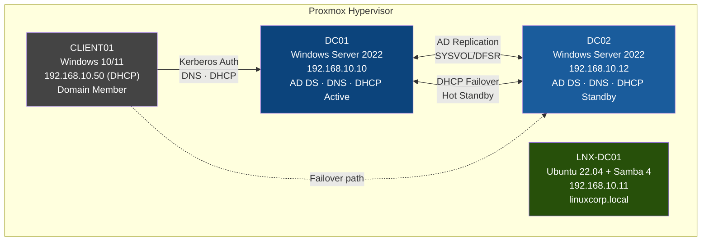
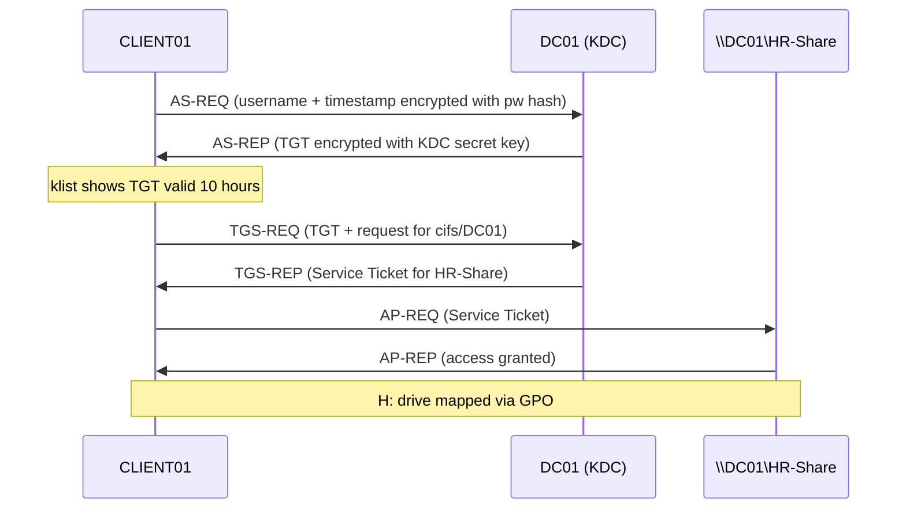
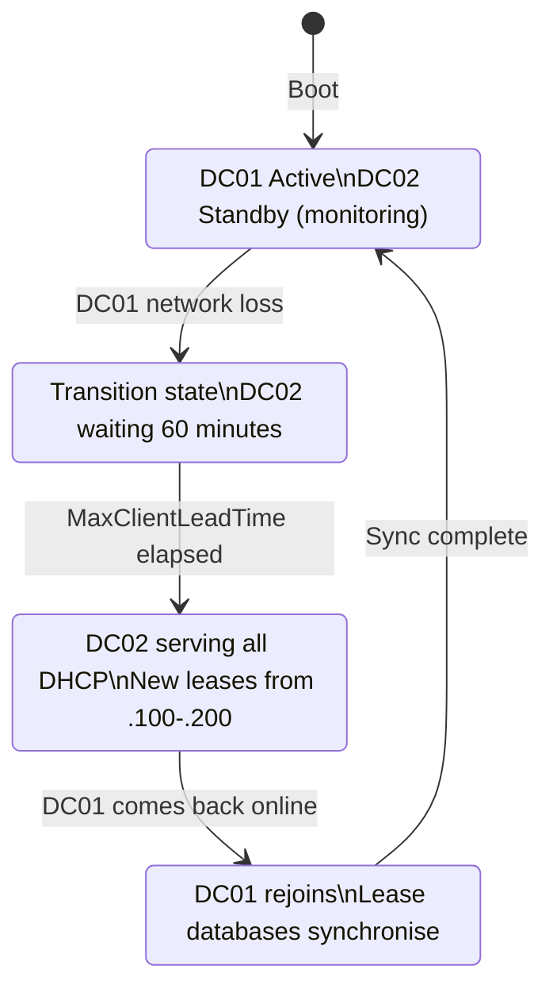

# Architecture Overview

## High-Level Design

The corp.local AD environment simulates a small-to-medium enterprise identity infrastructure
with full redundancy at the directory, DNS, and DHCP layers.

---

## Component Diagram (Mermaid)



---

## Authentication Flow (Mermaid)



---

## OU Structure

```
corp.local
└── Domain Controllers       (built-in — DC01, DC02)
└── TechCorp                 (root company OU)
    ├── IT                   (IT-Admins group, 3 users)
    │   ├── rahul.sharma
    │   ├── priya.patel
    │   └── meena.iyer
    ├── HR                   (HR-Staff group, 3 users)
    │   │   GPO: HR-Desktop-Policy (blocks Control Panel)
    │   │   GPO: Corp-DriveMap-Policy (H: drive)
    │   ├── ankit.mehta
    │   ├── sunita.rao
    │   └── sanjay.kumar
    ├── Development          (Dev-Team group, 4 users)
    │   │   GPO: Corp-DriveMap-Policy (H: drive)
    │   ├── karan.singh
    │   ├── deepa.nair
    │   ├── vikram.joshi
    │   └── pooja.gupta
    └── Servers              (computer accounts for servers)
```

---

## DHCP Failover Architecture



---

## Network Zone Layout

```
Internet
    │
    ▼
Gateway / Router (192.168.10.1)
    │
    ▼
192.168.10.0/24 — corp.local LAN (single flat network for lab)
    │
    ├─ .10  DC01      (AD DS, DNS, DHCP Active)
    ├─ .11  LNX-DC01  (Samba AD, linuxcorp.local)
    ├─ .12  DC02      (AD DS, DNS, DHCP Standby)
    ├─ .20  webserver01  (static, DNS A record only)
    ├─ .21  fileserver01 (static, DNS A record only)
    │
    └─ .100–.200  DHCP dynamic pool
                  CLIENT01 = .50 (static) or from pool
```
